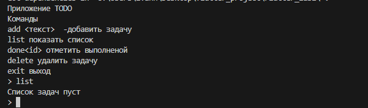

# Лабораторная работа №1. Быстрое погружение в язык Dart

Консольное приложение **ToDo** для управления списком задач. Проект демонстрирует основы языка Dart: синтаксис, Null Safety, коллекции, классы, асинхронность и работу с пакетами.

---

## Информация об авторе

- **Автор:** [Тимонин И.В]
- **Группа:** [ИСП-233]

---

## Скриншот приложения



---

## Как запустить

1. Убедитесь, что установлен Dart SDK (3.0+):
```bash
dart --version
```
2. Клонируйте репозиторий:
```bash
git clone <URL репозитория>
cd todo_app
```
3. Запустите приложение:
```bash
dart run bin/todo_app.dart
```

## Что изученно
- Базовый синтаксис Dart: ```main()```, ```print```, строковая интерполяция.
- Ключевые слова ```final``` и ```const```, их различия.
- Использование пакетов из `pub.dev` (на примере ansicolor).

## Ответы на вопросы
- Чем final отличается от const в Dart?
final означает, что значение присваивается один раз и может быть известно только во время выполнения (runtime). const – константа времени компиляции, её значение должно быть вычислено до запуска программы.

- Что означает String??
String? – это nullable‑тип: переменная может содержать либо строку, либо null. В Dart sound null safety, поэтому обычный String гарантированно не может быть null.

- Чем Future отличается от обычного значения? Что означает await с точки зрения потока выполнения?
Future – объект, который представляет отложенное (асинхронное) значение, которое появится позже. await приостанавливает выполнение текущей async‑функции до получения результата Future, но не блокирует основной поток. Остальная программа может продолжать работу (event loop).
  
- Зачем в Dart именованные конструкторы, если в C# есть перегрузка?
В Dart нет перегрузки конструкторов по сигнатуре. Именованные конструкторы (ClassName.name()) позволяют создавать несколько конструкторов с разными именами и логикой инициализации, что заменяет перегрузку.
